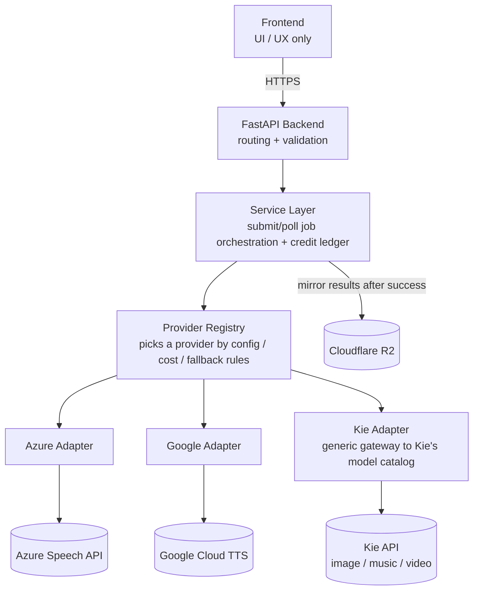

# AI Voice Labs

A unified backend platform for AI-generated content — text-to-speech, voice cloning, and image/music/video generation — that talks to multiple third-party providers (Azure, Google, Kie's model marketplace, and others) through a single provider-adapter layer, so the rest of the system never depends on a specific vendor's API or on whether that vendor's calls are synchronous or asynchronous.

This is a ground-up rewrite of an earlier prototype. The rewrite exists because the original grew organically until its structure and its third-party integrations were tangled together; this version separates them from day one.

> **Status: early-stage, TTS + voice cloning running end-to-end.** Text-to-speech (Azure, Google, Fish Audio) and voice cloning (Fish Audio — train a reusable voice, then speak with it) both work all the way through — sign up, generate, play back, mark public — verified in a real browser against real infrastructure (Neon, Firebase, Azure Speech, Google Cloud TTS, Fish Audio, Cloudflare R2), not mocked. Kie and Android aren't built yet. See [`docs/architecture.md`](docs/architecture.md) for the full design and [`docs/decisions/`](docs/decisions/README.md) for the reasoning behind each major choice.

## Architecture at a glance



Three ideas carry the whole design:
1. **Adding or replacing a vendor means writing one new adapter, not touching business logic.** ([ADR 0001](docs/decisions/0001-provider-adapter-layer.md))
2. **Every capability — instant TTS or a multi-minute video render — is exposed the same way: submit a job, poll it to completion.** Synchronous vendors just happen to finish before the first response goes out. ([ADR 0002](docs/decisions/0002-unified-async-job-model.md))
3. **Users spend credits; cost is computed per call** (text length, video duration/resolution, ...) and held, then settled or fully released, against the job's own lifecycle. ([ADR 0003](docs/decisions/0003-credit-ledger-hold-then-settle.md))

## Tech stack

| Layer | Choice | Status |
|---|---|---|
| Backend | FastAPI (Python) | Decided |
| Backend architecture | Provider adapter layer (`providers/` → `services/` → `api/`) | Decided |
| Frontend | Next.js (App Router) + TypeScript + Tailwind | Decided — see [ADR 0011](docs/decisions/0011-frontend-framework.md) |
| Auth | Firebase Auth | Decided — see [ADR 0008](docs/decisions/0008-auth-provider.md) |
| Database | Postgres + SQLAlchemy/SQLModel | Decided — see [ADR 0006](docs/decisions/0006-database-orm-choice.md) (hosting: Neon is a candidate, carried from the prior project) |
| Generated-asset storage | Cloudflare R2, retained on a configurable expiry window | Decided |
| Billing model | Credit wallet, hold-then-settle per job | Decided |
| Android | Native Kotlin/Compose, no WebView wrapper | Decided |
| Agent / AGI layer | — | Not yet designed; deferred until the backend + frontend skeleton is running |

## Repository structure

```
.
├── backend/            # FastAPI app: providers/, services/, api/, core/
├── frontend/
│   ├── web/             # Next.js: marketing + authenticated app, one deployable
│   └── admin/            # internal tool, separate deployment, staff-only
├── android/             # native Kotlin/Compose app — calls the backend API directly
├── docs/               # All engineering documentation — start at docs/README.md
└── CLAUDE.md           # Working notes for AI-assisted development on this repo
```

Four client surfaces (`frontend/web`, `frontend/admin`, `android/`) share one backend API — none of them talks to a provider or holds business logic directly. See [ADR 0005](docs/decisions/0005-frontend-surfaces.md).

## Documentation

Everything beyond this landing page lives in [`docs/`](docs/README.md):

- [`docs/architecture.md`](docs/architecture.md) — system design, diagrams, request flow
- [`docs/data-model.md`](docs/data-model.md) — the database schema
- [`docs/api-contract.md`](docs/api-contract.md) — the backend's HTTP surface
- [`docs/flows.md`](docs/flows.md) — checklist of every operational flow and how defined it is
- [`docs/decisions/`](docs/decisions/README.md) — ADRs: every non-obvious technical choice, with the reasoning
- [`CONTRIBUTING.md`](CONTRIBUTING.md) — how changes are made and documented in this repo

## Getting started

```
backend/README.md        # FastAPI setup — Postgres, Firebase Admin SDK, Fish Audio, R2
frontend/web/README.md   # Next.js setup — Firebase web config, points at the backend
```

Both need real third-party credentials to run (see those READMEs for exactly which). `frontend/admin` and `android/` aren't started.
