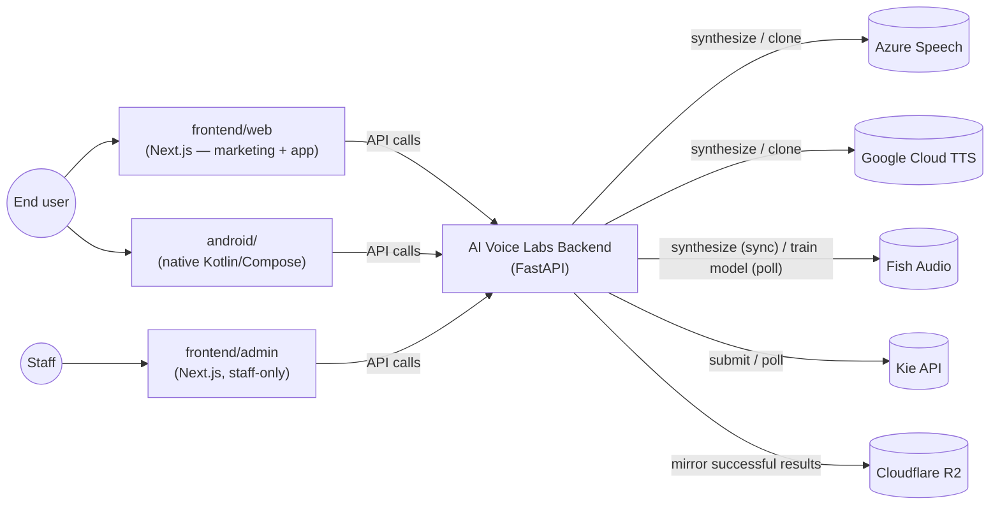
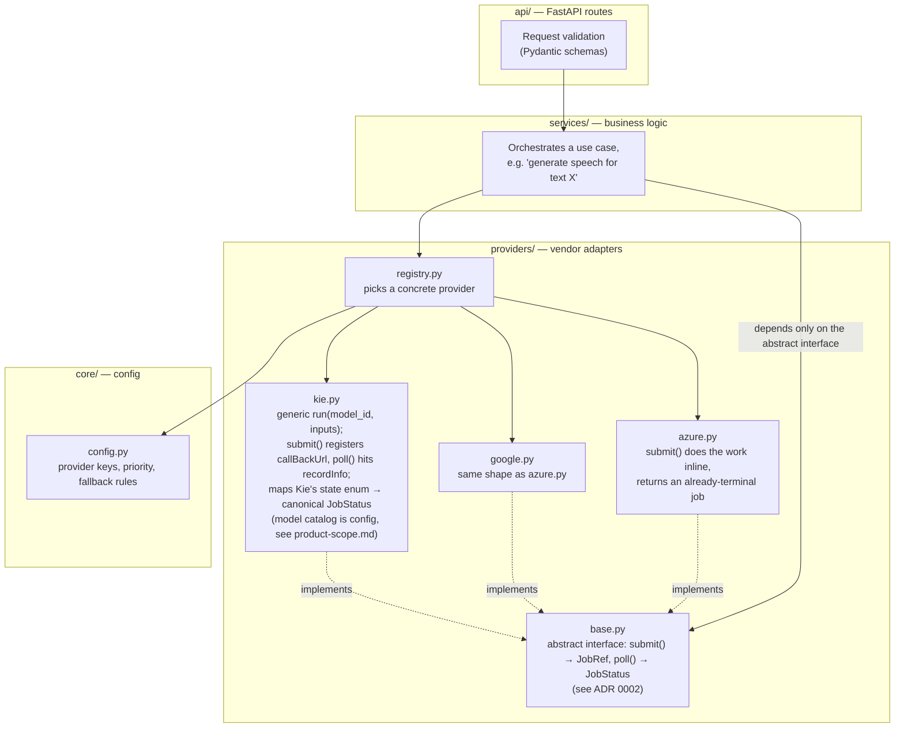
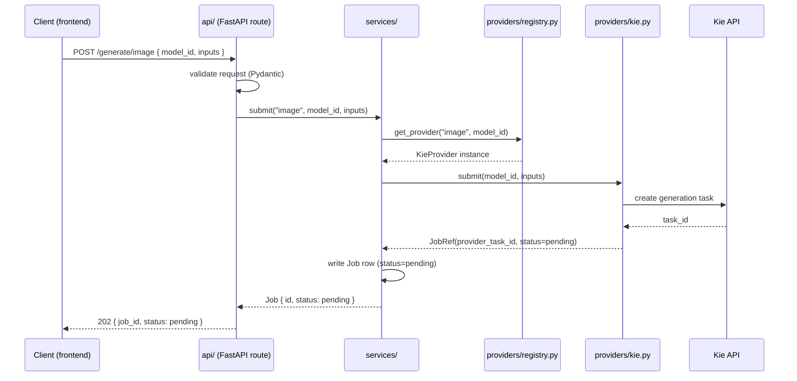
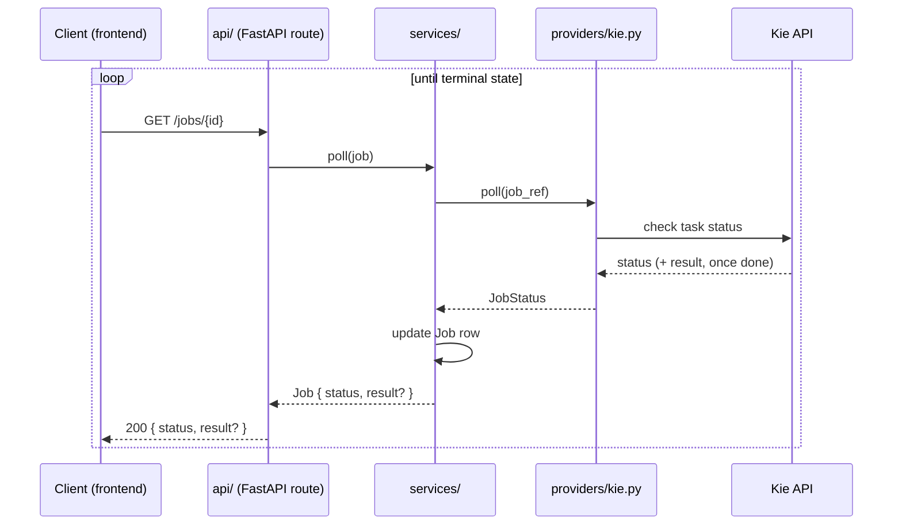
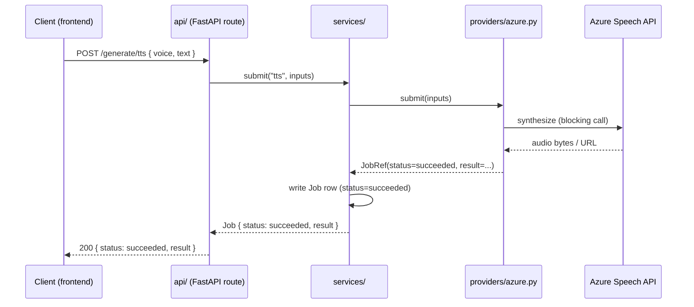

# Architecture

## 1. System context

Who talks to the system, and what it talks to.



No client — web, Android, or admin — calls a third-party provider directly; every external integration is behind the backend (see [ADR 0005](decisions/0005-frontend-surfaces.md) for why there are three client surfaces sharing one API). R2 is not a generation provider — it's where results get mirrored after success so history survives past the providers' own URL expiry (see [ADR 0004](decisions/0004-asset-mirroring-r2-retention.md)).

## 2. Backend module boundaries



**Rule:** `services/` never imports a concrete provider (`azure.py`, `google.py`, ...) directly — only the `base.py` interface and the `registry.py` selector. This is what makes swapping or adding a vendor a one-file change. See [ADR 0001](decisions/0001-provider-adapter-layer.md) for why this boundary exists.

## 3. Request flow — unified async job model

Every capability, regardless of the underlying provider's native call shape, is exposed as **submit → poll a job** (see [ADR 0002](decisions/0002-unified-async-job-model.md)). A synchronous provider just finishes the work before the first response goes out; an asynchronous one doesn't.

### 3a. Submitting a job (Kie example — asynchronous provider)



### 3b. Polling a job to completion



### 3c. Synchronous provider (Azure/Google) — same contract, no waiting



The frontend can choose to treat 3c as "instant" (it already has the result on the first response) while showing a progress state for 3a/3b — that's a UI decision, not a different API contract.

If a provider fails or is over quota, the fallback path is: `registry.py` catches the failure and retries with the next provider in priority order — this logic lives entirely in the registry, so `services/` and `api/` are unaware a fallback happened.

**TTS specifically routes by *voice*, not by a fixed capability→provider mapping** (implemented, Azure + Google, [ADR 0007](decisions/0007-scheduled-tasks-module.md)'s catalog sync): a `voice_catalog` row carries its own `provider` + `provider_voice_id` + `locale` (docs/data-model.md), so picking a voice *is* picking a provider. `services/jobs.py submit_tts()` resolves the chosen `voice_id` (or, for a user's own cloned voice, `voice_model_id` — [ADR 0009](decisions/0009-voice-cloning-reusable-asset.md)) to a row carrying its own provider, then calls `registry.get_provider_by_name(row.provider)` — a second lookup shape alongside `get_provider(capability)`, added for exactly this case (a request that already knows which vendor it needs, rather than wanting the capability's default/fallback chain). **A voice is required** — exactly one of `voice_id`/`voice_model_id` must be given (`schemas.TTSRequest`'s validator); there is no default voice to fall back to when neither is given (an earlier version of this fell back to Fish Audio's own generic voice, which had nothing to do with what the picker actually offers — corrected once that was pointed out).

### 3d. Kie specifics (verified against [Kie's task-detail API](https://docs.kie.ai/market/common/get-task-detail))

Confirmed from Kie's docs — these live entirely inside `providers/kie.py`, never surfacing past `base.py`'s canonical interface:

- **Polling**: `GET https://api.kie.ai/api/v1/jobs/recordInfo?taskId=...`, bearer-token auth. Returns `state` as one of `"waiting"`, `"queuing"`, `"generating"`, `"success"`, `"fail"` — `kie.py`'s `poll()` maps these to our canonical `JobStatus` (`waiting`/`queuing`/`generating` → `processing`; `success` → `succeeded`; `fail` → `failed`). The raw Kie state is worth keeping alongside the canonical one (e.g. a `provider_state` field on the job) so the UI can show "queued" vs. "generating" instead of one flat "processing" spinner — optional, doesn't affect the contract.
- **Webhooks are supported**: passing `callBackUrl` at task creation is Kie's documented alternative to polling. **Decision: prefer the webhook, keep polling as the fallback/verification path** — `submit()` always registers a callback endpoint; `poll()` still works standalone (needed anyway for Azure/Google-style adapters and for recovering if a callback is ever missed).
- **Kie reports its own cost per task** (`creditsConsumed`, returned once `state` is terminal). This resolves the open item in [ADR 0003](decisions/0003-credit-ledger-hold-then-settle.md) about whether `actual_cost` can diverge from `estimated_cost` for Kie: it can, and Kie tells us exactly how much it charged, so our own pricing rule can settle `actual_cost` from Kie's `creditsConsumed` (times our own exchange rate/margin) instead of re-deriving it from request parameters.
- **Result URLs expire ~24 hours after completion** (`resultJson.resultUrls`). Per [ADR 0004](decisions/0004-asset-mirroring-r2-retention.md), a successful job's assets are mirrored into Cloudflare R2 before that window closes, with a configurable retention period rather than kept forever.
- **Polling policy**: start at 2–3s intervals with backoff, give up after 10–15 minutes (treat as `failed`/timeout if no terminal state by then); a `429` means back off harder. This is `kie.py`'s internal retry policy, invisible to `services/`.

If we ever build against another async, catalog-style vendor, this section is the template for what "provider specifics" means in practice — vendor state enum, callback vs. polling, vendor-native cost reporting, asset lifetime all stay inside that vendor's own adapter.

### 3e. Fish Audio specifics (verified against [Fish Audio's API reference](https://docs.fish.audio/api-reference/introduction))

- **TTS is synchronous**: `POST /v1/tts`, bearer-token auth, streams audio directly in the response (chunked transfer encoding) — same shape as `azure.py`/`google.py`'s `submit()` (does the work inline, returns an already-terminal job).
- **Voice cloning is two calls, but the first one isn't actually async**: `POST /model` (multipart — the sample audio as `voices`, its transcript as `texts`) trains a reusable voice, returning a `model_id`. The original version of this doc assumed `state` (`created`/`training`/`trained`/`failed`) meant polling this like Kie's `recordInfo` — **corrected after actually calling it**: with `train_mode="fast"` (the only mode `fish_audio.py` uses — `"full"` mode's timing isn't verified, so isn't exposed), the create response already has `state: "trained"`, synchronously, same request. That `model_id` is then passed as `reference_id` into ordinary sync `/v1/tts` calls, any number of times, to actually generate speech in that voice — verified end-to-end (trained a real test model, spoke with it immediately, deleted it, `backend/README.md`).
- **Implemented** ([ADR 0009](decisions/0009-voice-cloning-reusable-asset.md)): `fish_audio.py`'s "train a voice" is its own job (`capability: voice_model_training`) that creates a `voice_models` row on success instead of an `assets` row — and since training turned out synchronous too, it's exactly `submit_tts()`'s shape (`services/jobs.py submit_voice_model_training()`), no `poll()` needed. "Speak with a voice" is then just a normal `tts` job referencing that `voice_models` row via `voice_model_id`, resolved to a provider exactly like a `voice_catalog` row is (§3c above). Training is free (`estimated_cost=0`) — ports the prior project's own real pricing (never charged for cloning, only for using a clone to generate speech), resolving ADR 0009's open item on this. Whether Azure/Google have an equivalent is still unconfirmed/out of scope — Fish Audio is the only provider this integration covers.

## 4. Directory layout (backend)

```
backend/
├── app/
│   ├── providers/
│   │   ├── base.py          # abstract interface: submit() -> JobRef, poll() -> JobStatus (ADR 0002)
│   │   ├── azure.py
│   │   ├── google.py
│   │   ├── kie.py            # generic run(model_id, inputs); model catalog is config, not code
│   │   └── registry.py      # selects a concrete provider from config/request params
│   ├── services/
│   │   ├── jobs.py            # orchestrates submit/poll, owns the hold→settle/release lifecycle (ADR 0003)
│   │   ├── credits.py          # pricing-rule lookup + wallet operations (hold, settle, release)
│   │   ├── assets.py            # mirrors a succeeded job's output into R2, tracks retention (ADR 0004)
│   │   └── catalog.py            # reads the synced voice/model catalog (written by scheduled/, read by api/)
│   ├── scheduled/              # periodic, non-request-triggered work (ADR 0007) — calls services/ + providers/ like any request handler would
│   │   ├── sync_catalog.py       # pulls each provider's voice/model list into our DB
│   │   └── sweep_stuck_jobs.py    # resolves timed-out jobs to failed, releases their hold
│   ├── api/                  # FastAPI routes — input validation, calls services/
│   ├── models/                # Jobs, credit ledger, asset, and catalog tables (see below)
│   └── core/
│       ├── config.py         # provider keys, priority, fallback policy, Kie model catalog, pricing rules, R2 credentials + retention config
│       └── auth.py            # verify_identity(token) -> (user_id, role) — wraps Firebase Admin SDK (ADR 0008); routes call this, never Firebase directly
```

*Scheduling mechanism (what actually triggers `scheduled/`'s functions on a timer) is an open implementation choice — see [ADR 0007](decisions/0007-scheduled-tasks-module.md).*

**Data model**: the full schema (tables, ER diagram, notes) lives in [`data-model.md`](data-model.md), built on Postgres ([ADR 0006](decisions/0006-database-orm-choice.md)) — not duplicated here to avoid the two drifting apart.

This layout is not yet implemented — it is the target structure for the first backend milestone.

## 5. Open questions

- Frontend framework, database, and auth are all decided (Next.js — [ADR 0011](decisions/0011-frontend-framework.md); Postgres/SQLAlchemy — [ADR 0006](decisions/0006-database-orm-choice.md); Firebase Auth — [ADR 0008](decisions/0008-auth-provider.md)).
- The Agent/AGI layer is intentionally undesigned until the backend + frontend skeleton is running end-to-end — this includes any future LLM-driven model-selection router (see [product-scope.md §1.1](product-scope.md)).
- How the frontend learns a job is done: plain polling of `GET /jobs/{id}`, or a push mechanism (WebSocket/SSE) — not yet decided, doesn't block backend work.
- Exact pricing formulas per capability/model, the top-up (payment provider) mechanism, and the exact asset retention period(s) (see [ADR 0004](decisions/0004-asset-mirroring-r2-retention.md)) are still open — all are config values to fill in during implementation, none block the schemas above.

Each of these, once decided, gets its own ADR in [decisions/](decisions/README.md) rather than being folded silently into this document.
