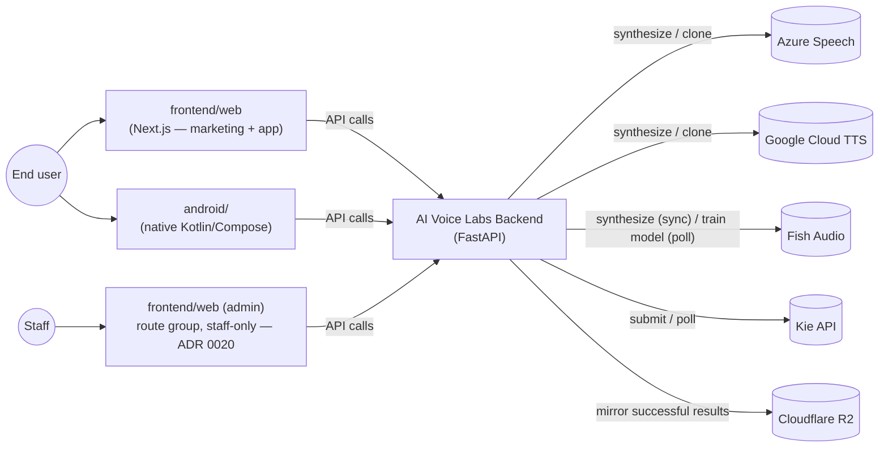
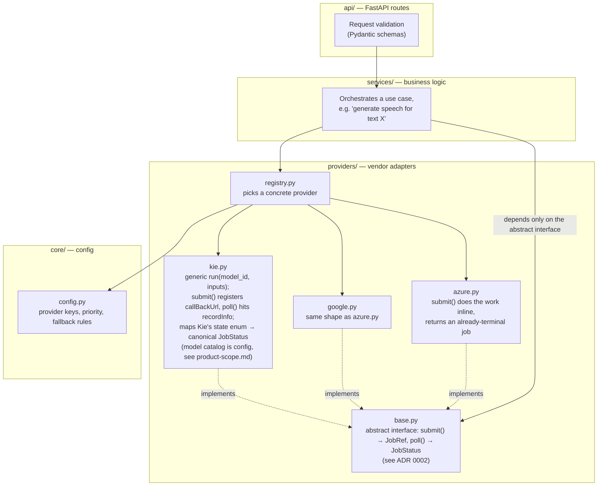
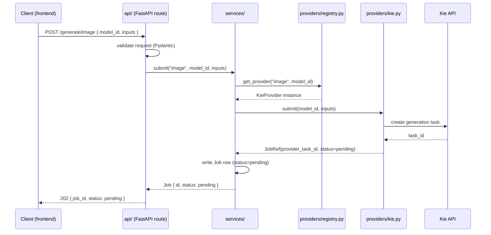
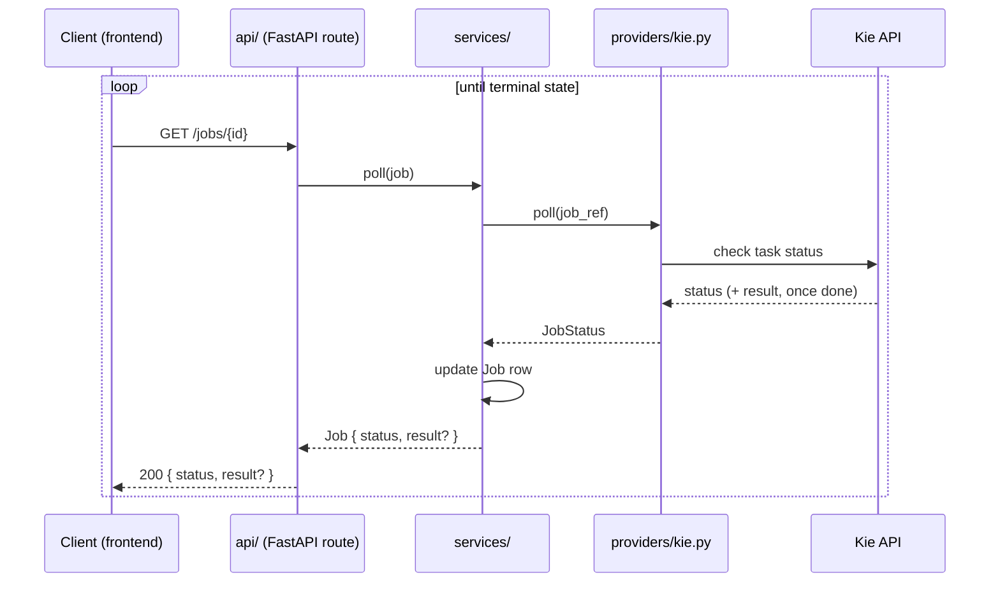
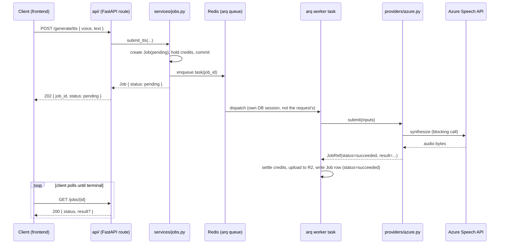
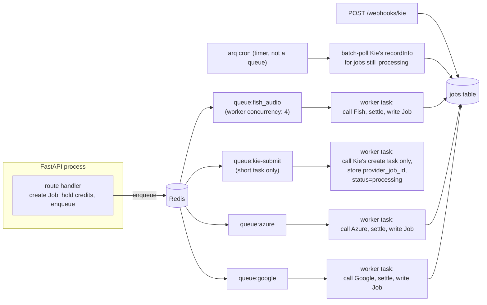

# Architecture

## 1. System context

Who talks to the system, and what it talks to.



No client — web, Android, or admin — calls a third-party provider directly; every external integration is behind the backend (see [ADR 0005](decisions/0005-frontend-surfaces.md) for why there are three client surfaces sharing one API). R2 is not a generation provider — it's where results get mirrored after success so history survives past the providers' own URL expiry (see [ADR 0004](decisions/0004-asset-mirroring-r2-retention.md)).

## 2. Backend module boundaries



**Rule:** `services/` never imports a concrete provider (`azure.py`, `google.py`, ...) directly — only the `base.py` interface and the `registry.py` selector. This is what makes swapping or adding a vendor a one-file change. See [ADR 0001](decisions/0001-provider-adapter-layer.md) for why this boundary exists.

**Since [ADR 0014](decisions/0014-background-job-execution.md)**: this diagram's `services/` still owns 100% of the business logic (resolving a voice, calling the right provider via `registry.py`, settling/releasing credits) — that hasn't moved. What changed is *when* it runs: `submit_tts()` (called from `api/`) now only creates the `Job` + hold and enqueues; the provider-calling part is a separate function in the same module (e.g. `execute_tts_job(db, job_id)`) that an arq worker task calls with its own DB session, not the request's. `worker/` is thin arq-specific plumbing around that — it doesn't contain business logic of its own. `core/queue.py` (the enqueue helper) is the one new thing `services/` reaches for, alongside `registry.py`.

## 3. Request flow — unified async job model

Every capability, regardless of the underlying provider's native call shape, is exposed as **submit → poll a job** (see [ADR 0002](decisions/0002-unified-async-job-model.md)). A synchronous provider just finishes the work before the first response goes out; an asynchronous one doesn't.

### 3a. Submitting a job (Kie example — asynchronous provider)



### 3b. Polling a job to completion



### 3c. Synchronous-native provider (Azure/Google/Fish) — same contract, worker does the wait

**Changed by [ADR 0014](decisions/0014-background-job-execution.md)** — the diagram below is the current shape; the note after it is what this replaced and why.



Before ADR 0014, step "W" happened inline inside the request handler — `submit_tts()` itself did `await provider.submit(...)` and only returned once the vendor responded, so the first response really was already terminal. That fell over at very modest concurrency (the request's DB session was held for the whole vendor round-trip against a default 15-connection pool; Fish Audio's own account allows only 5 concurrent requests) — see ADR 0014 for the concrete numbers. The API shape (`202` + a `job_id` + poll `GET /jobs/{id}`) hasn't changed; only where the vendor call actually happens has.

If a provider fails or is over quota, the fallback path is: `registry.py` catches the failure and retries with the next provider in priority order — this logic lives entirely in the registry, so `services/` and `api/` are unaware a fallback happened.

**TTS specifically routes by *voice*, not by a fixed capability→provider mapping** (implemented, Azure + Google, [ADR 0007](decisions/0007-scheduled-tasks-module.md)'s catalog sync): a `voice_catalog` row carries its own `provider` + `provider_voice_id` + `locale` (docs/data-model.md), so picking a voice *is* picking a provider. `services/jobs.py submit_tts()` resolves the chosen `voice_id` (or, for a user's own cloned voice, `voice_model_id` — [ADR 0009](decisions/0009-voice-cloning-reusable-asset.md)) to a row carrying its own provider, then calls `registry.get_provider_by_name(row.provider)` — a second lookup shape alongside `get_provider(capability)`, added for exactly this case (a request that already knows which vendor it needs, rather than wanting the capability's default/fallback chain). **A voice is required** — exactly one of `voice_id`/`voice_model_id` must be given (`schemas.TTSRequest`'s validator); there is no default voice to fall back to when neither is given (an earlier version of this fell back to Fish Audio's own generic voice, which had nothing to do with what the picker actually offers — corrected once that was pointed out).

### 3d. Kie specifics (verified against [Kie's task-detail API](https://docs.kie.ai/market/common/get-task-detail))

Confirmed from Kie's docs — these live entirely inside `providers/kie.py`, never surfacing past `base.py`'s canonical interface:

- **Polling**: `GET https://api.kie.ai/api/v1/jobs/recordInfo?taskId=...`, bearer-token auth. Returns `state` as one of `"waiting"`, `"queuing"`, `"generating"`, `"success"`, `"fail"` — `kie.py`'s `poll()` maps these to our canonical `JobStatus` (`waiting`/`queuing`/`generating` → `processing`; `success` → `succeeded`; `fail` → `failed`). The raw Kie state is worth keeping alongside the canonical one (e.g. a `provider_state` field on the job) so the UI can show "queued" vs. "generating" instead of one flat "processing" spinner — optional, doesn't affect the contract.
- **Webhooks are supported**: passing `callBackUrl` at task creation is Kie's documented alternative to polling. **Decision: prefer the webhook, keep polling as the fallback/verification path** — `submit()` registers a callback endpoint only when this backend has a public URL configured (`PUBLIC_BASE_URL`, empty in local dev); `poll()` always works standalone regardless, which is what the poll-sweep cron (§3f) relies on.
- **Kie reports its own cost per task** (`creditsConsumed`, returned once `state` is terminal). This resolves the open item in [ADR 0003](decisions/0003-credit-ledger-hold-then-settle.md) about whether `actual_cost` can diverge from `estimated_cost` for Kie: it can, and settlement uses `creditsConsumed` directly, 1:1 — [ADR 0015](decisions/0015-kie-model-catalog.md) explains why no exchange-rate/margin layer exists yet (the curated catalog's own pricing numbers are copied from Kie's real displayed prices, so the units already match).
- **Result URLs expire ~24 hours after completion** (`resultJson` — a JSON *string*, confirmed by a real call, containing `resultUrls`). Per [ADR 0004](decisions/0004-asset-mirroring-r2-retention.md), a successful job's assets are mirrored into Cloudflare R2 before that window closes, with a configurable retention period rather than kept forever.
- **Under [ADR 0014](decisions/0014-background-job-execution.md), "submit" and "track to completion" are two separate execution steps, not one worker task** — see §3f below. `kie.py`'s `submit()` always returns a `processing` `JobRef` (never waits); `poll()` is called later, by the webhook route or the cron sweep, never from within a long-lived worker task.
- **The model catalog itself — which `model_id`s exist, their input schema, their pricing — is [ADR 0015](decisions/0015-kie-model-catalog.md)'s subject**, not this section: two real tables (`kie_categories`/`kie_models`), hand-curated, verified against two real model families (Flux-2, GPT Image 2.5). `providers/kie.py` itself has zero per-model code — `model` and `input` are opaque values it never inspects.
- **A real gotcha, found by an actual failed call, not anticipated**: Kie returned **HTTP 500** for `flux-2/pro-text-to-image` when a required `resolution` field was missing from `input` — not a 400. `services/jobs.py`'s shared `_is_transient_error()` heuristic (5xx = transient, retry) treats this as retryable, so a genuinely wrong/incomplete `input_schema` costs a wasted ~15s of retries before failing for real, rather than failing immediately. No charge either way (ADR 0003), so this is a latency/wasted-call cost, not a correctness bug — the actual fix is keeping `kie_models.input_schema` complete (verified per real model, not guessed from Kie's simplified playground Form view, which doesn't always show every required field).
- **Image-to-image needs a real public URL, not a file upload or base64** ([ADR 0016](decisions/0016-kie-image-to-image-uploads.md)) — confirmed against a real request body from both Flux-2 and GPT Image 2.5: the reference-image field (`input_urls` on every model checked) is an array Kie's own servers fetch themselves. This doesn't fit `services/assets.py`'s existing authenticated-proxy story (`GET /jobs/{id}/asset`) at all, since Kie can't attach this app's Firebase header — `POST /kie/uploads` hosts the reference at a short-lived public R2 URL instead, deleted the moment its job resolves.

If we ever build against another async, catalog-style vendor, this section is the template for what "provider specifics" means in practice — vendor state enum, callback vs. polling, vendor-native cost reporting, asset lifetime all stay inside that vendor's own adapter.

### 3e. Fish Audio specifics (verified against [Fish Audio's API reference](https://docs.fish.audio/api-reference/introduction))

- **TTS is synchronous**: `POST /v1/tts`, bearer-token auth, streams audio directly in the response (chunked transfer encoding) — same shape as `azure.py`/`google.py`'s `submit()` (does the work inline, returns an already-terminal job).
- **TTS model is a config value, not a constant**: `s2.1-pro` via the `model` header — verified against Fish Audio's current docs (2026-09-12): it's their recommended production model and also the server-side default if the header is omitted, but sent explicitly rather than relying on an undocumented default. No "v2" model exists (naming is generational: `s1`/`s2-pro`/`s2.1-pro`/`s2.1-pro-free`/`drama-3-preview`); `speech-1.5`/`speech-1.6` (used by the prior project's adapter) were deprecated 2026-02-28. The actual value lives in `app_settings.fish_tts_model` ([ADR 0012](decisions/0012-app-settings-table.md)), not hardcoded — Fish can retire/replace their recommended model on their own schedule, so bumping this is `PATCH /admin/settings/fish_tts_model`, not a deploy.
- **Voice cloning is two calls, but the first one isn't actually async**: `POST /model` (multipart — the sample audio as `voices`, its transcript as `texts`) trains a reusable voice, returning a `model_id`. The original version of this doc assumed `state` (`created`/`training`/`trained`/`failed`) meant polling this like Kie's `recordInfo` — **corrected after actually calling it**: with `train_mode="fast"` (the only mode `fish_audio.py` uses — `"full"` mode's timing isn't verified, so isn't exposed), the create response already has `state: "trained"`, synchronously, same request. That `model_id` is then passed as `reference_id` into ordinary sync `/v1/tts` calls, any number of times, to actually generate speech in that voice — verified end-to-end (trained a real test model, spoke with it immediately, deleted it, `backend/README.md`).
- **Implemented** ([ADR 0009](decisions/0009-voice-cloning-reusable-asset.md)): `fish_audio.py`'s "train a voice" is its own job (`capability: voice_model_training`) that creates a `voice_models` row on success instead of an `assets` row — and since training turned out synchronous too, it's exactly `submit_tts()`'s shape (`services/jobs.py submit_voice_model_training()`), no `poll()` needed. "Speak with a voice" is then just a normal `tts` job referencing that `voice_models` row via `voice_model_id`, resolved to a provider exactly like a `voice_catalog` row is (§3c above). Training is free (`estimated_cost=0`) — ports the prior project's own real pricing (never charged for cloning, only for using a clone to generate speech), resolving ADR 0009's open item on this. Whether Azure/Google have an equivalent is still unconfirmed/out of scope — Fish Audio is the only provider this integration covers.
- **No language parameter, on either call** — a real structural difference from Azure/Google, not a gap: those APIs need an explicit locale because a voice *is* a locale there; Fish Audio's don't take one at all (verified against their docs, 2026-09-12). `POST /model` runs ASR on the sample to infer what's said (and its language) when `texts` is omitted; `POST /v1/tts`'s `s2.1-pro` is multilingual and infers the target language from the text itself, with the cloned voice's own accent carried over regardless of what language it's asked to speak.

### 3f. Background job execution — queues, workers, why Kie can't block TTS ([ADR 0014](decisions/0014-background-job-execution.md))

Every capability's "actually call the provider" step runs in an **arq** (asyncio-native task queue, Redis-backed) worker task, never inside the request handler — §3c's diagram is what this looks like end to end for a synchronous-native provider. The part worth a dedicated section is how queues are split, because the split is what actually delivers the guarantee "a slow or rate-limited provider can't starve a fast one":



- **One queue per provider**, each with its own worker concurrency cap — `queue:fish_audio` is capped at 4 (Fish Audio's real, observed `ratelimit-limit-concurrency: 5`, one seat of headroom); Azure/Google get their own queues with looser, provisional caps. A burst of Fish-routed jobs queues up *inside `queue:fish_audio` only* — Azure/Google/Kie jobs keep flowing.
- **Kie's task is deliberately short** (`queue:kie-submit`): it calls Kie's create-task API and returns — it never waits for Kie to actually finish generating. If it did, a burst of slow Kie jobs would occupy worker capacity for minutes each, and since nothing distinguishes "a worker busy for 2 seconds" from "a worker busy for 3 minutes" in a shared pool, a fast TTS job queued behind enough slow Kie jobs would wait just as long. Splitting them into separate queues makes that structurally impossible, not just unlikely.
- **Completion tracking for Kie is a cron sweep, not a per-job wait**: the webhook (§3d) is the primary path; a periodic arq cron job batch-checks whatever's still `processing` past some age. A cron job scans many rows in one pass and moves on — it doesn't block itself on any single slow job the way a per-job polling task would.
- **A job's DB writes always happen from a session the worker task opens itself**, never the request's own session — the request's session is done and returned to the pool the moment the job is enqueued.
- **Enqueue can fail** (Redis unreachable) — handled as a first-class error, not an edge case: the route handler releases the just-created hold and marks the job `failed` immediately rather than returning a `202` for a job that will never run. See ADR 0014's "Enqueue failure" note.

## 4. Directory layout (backend)

```
backend/
├── app/
│   ├── providers/
│   │   ├── base.py          # abstract interface: submit() -> JobRef, poll() -> JobStatus (ADR 0002)
│   │   ├── azure.py
│   │   ├── google.py
│   │   ├── fish_audio.py     # TTS + voice cloning (ADR 0009)
│   │   ├── kie.py            # generic submit(model_id, input)/poll() — zero per-model code (ADR 0015)
│   │   └── registry.py      # selects a concrete provider from config/request params
│   ├── services/
│   │   ├── jobs.py            # orchestrates submit/execute, owns the hold→settle/release lifecycle (ADR 0003/0014)
│   │   ├── credits.py          # wallet operations (hold, settle, release, ADR 0003)
│   │   ├── assets.py            # mirrors a succeeded job's output into R2, tracks retention (ADR 0004)
│   │   ├── voice_catalog.py      # reads the synced Azure/Google voice list (written by scheduled/sync_catalog.py)
│   │   ├── voice_models.py        # a user's own cloned voices (ADR 0009)
│   │   ├── kie_catalog.py          # the hand-curated Kie model catalog — categories, models, pricing rule (ADR 0015)
│   │   ├── menu.py                 # the capability menu, stored in app_settings (ADR 0012)
│   │   ├── app_settings.py          # simple tunable scalars (ADR 0012)
│   │   ├── gallery.py                # the public gallery query (ADR 0010)
│   │   └── users.py                   # first-login bootstrap (wallet + signup bonus)
│   ├── scheduled/              # periodic, non-request-triggered work run by hand today (ADR 0007)
│   │   └── sync_catalog.py       # pulls Azure/Google's real voice list into voice_catalog — `python -m app.scheduled.sync_catalog`
│   ├── worker/                # arq task definitions + WorkerSettings, one process per queue (ADR 0014/0015)
│   │   ├── tasks.py             # one task per provider/step: opens its own DB session, calls services/jobs.py's execute_*
│   │   ├── settings.py           # WorkerSettings per queue (FishAudioWorker/AzureWorker/GoogleWorker/KieSubmitWorker)
│   │   ├── cron.py               # arq cron jobs: stuck-job sweep (ADR 0007) + Kie poll-sweep (ADR 0015); catalog sync still run by hand
│   │   └── run_all.py            # local-dev convenience: every worker above in one process instead of five
│   ├── api/                  # FastAPI routes — input validation, calls services/
│   │   ├── routes_tts.py, routes_voice_models.py     # synchronous-provider capabilities
│   │   ├── routes_kie.py                              # generic /generate/kie + /kie/categories, /kie/models (ADR 0015)
│   │   ├── routes_webhooks.py                          # POST /webhooks/kie — Kie's callBackUrl target
│   │   ├── routes_jobs.py, routes_gallery.py, routes_catalog.py, routes_config.py, routes_me.py, routes_admin.py
│   │   └── schemas.py, errors.py
│   ├── models/                # Jobs, credit ledger, asset, and catalog tables — one models.py (see data-model.md)
│   └── core/
│       ├── config.py         # provider keys/base URLs (secrets — ADR 0012 distinguishes this from app_settings)
│       ├── queue.py           # arq Redis pool / enqueue helper (ADR 0014) — the one place services/ reaches to enqueue a task
│       ├── db.py              # async session factory
│       └── auth.py            # verify_identity(token) -> (user_id, role) — wraps Firebase Admin SDK (ADR 0008); routes call this, never Firebase directly
```

*Scheduling mechanism resolved by [ADR 0014](decisions/0014-background-job-execution.md): arq's cron feature runs `worker/cron.py`'s jobs (stuck-job sweep, Kie poll-sweep) on a timer, independent of the request-serving process. `sync_catalog.py` hasn't moved to a cron job yet — still run by hand.*

**Data model**: the full schema (tables, ER diagram, notes) lives in [`data-model.md`](data-model.md), built on Postgres ([ADR 0006](decisions/0006-database-orm-choice.md)) — not duplicated here to avoid the two drifting apart.

## 5. Open questions

- Frontend framework, database, and auth are all decided (Next.js — [ADR 0011](decisions/0011-frontend-framework.md); Postgres/SQLAlchemy — [ADR 0006](decisions/0006-database-orm-choice.md); Firebase Auth — [ADR 0008](decisions/0008-auth-provider.md)).
- The Agent/AGI layer is intentionally undesigned until the backend + frontend skeleton is running end-to-end — this includes any future LLM-driven model-selection router (see [product-scope.md §1.1](product-scope.md)).
- ~~How the frontend learns a job is done~~ — resolved: [ADR 0018](decisions/0018-realtime-job-updates-sse.md), Redis pub/sub (a worker's own terminal-state write) + `GET /events` (SSE, per-user channel) push job completion to the client live, no create page blocks waiting anymore. Real background push to a fully closed app (not just backgrounded) is still open — that needs FCM/APNs, a distinct piece of infrastructure ADR 0018 deliberately scoped out.
- Exact pricing formulas per capability/model, the top-up (payment provider) mechanism, and the exact asset retention period(s) (see [ADR 0004](decisions/0004-asset-mirroring-r2-retention.md)) are still open — all are config values to fill in during implementation, none block the schemas above.

Each of these, once decided, gets its own ADR in [decisions/](decisions/README.md) rather than being folded silently into this document.
