# Data Model

The authoritative schema. ADR 0002/0003/0004 sketched these fields as part of deciding *why* they exist — this document is the living, consolidated version; when they drift, this file wins and the ADRs stay as historical reasoning. Database/ORM choice: [ADR 0006](decisions/0006-database-orm-choice.md).

## Conventions

- **Primary keys**: UUID (Postgres `gen_random_uuid()`), not auto-increment integers — IDs get exposed externally (job ids, asset ids in API responses/URLs), and sequential integers leak volume/growth information an attacker or competitor could scrape. Every `string id PK` / `string ... FK` in this doc means UUID.
- **Naming**: snake_case for tables and columns (matches Python/SQLAlchemy convention, avoids quoting issues in raw SQL).
- **Timestamps**: `timestamptz`, stored/compared in UTC always; conversion to a user's local time is a display-layer concern, never a query-layer one.
- **Money/credits**: integers only (already reflected above — `balance`, `amount`, `estimated_cost` etc. are all `int`), never floating point, to avoid rounding error in the ledger.
- **Soft-delete**: not used by default — a row is either there or it's deleted. Introduce it only for a specific table if a real requirement shows up (none has yet).

## Entity relationships

```mermaid
erDiagram
    users ||--o| credit_wallets : has
    users ||--o{ jobs : submits
    users ||--o{ credit_holds : holds
    users ||--o{ voice_models : owns
    jobs ||--o| credit_holds : "reserved via"
    jobs ||--o| assets : "mirrors to"
    jobs }o--o| voice_models : "optionally uses (TTS) or creates (training)"
    credit_wallets ||--o{ credit_transactions : records

    users {
        string id PK "Firebase UID, see auth open item below"
        string email
        string role "user | staff | admin"
        timestamp created_at
    }
    credit_wallets {
        string id PK
        string user_id FK
        int balance "cached, must equal ledger sum"
        timestamp updated_at
    }
    credit_transactions {
        string id PK
        string wallet_id FK
        string type "topup | hold | settle | release"
        int amount "signed"
        string job_id FK "nullable — set for hold/settle/release"
        timestamp created_at
    }
    jobs {
        string id PK
        string user_id FK
        string capability "tts | voice_model_training | a kie_categories.id e.g. text-to-image (ADR 0015)"
        string provider "azure | google | fish_audio | kie"
        string model_id "nullable — Kie only, see product-scope.md 1.1"
        string status "pending | processing | succeeded | failed"
        string provider_state "nullable, raw vendor state (e.g. Kie's queuing/generating)"
        string provider_job_id "nullable — Kie's taskId, so the webhook/poll-sweep can find their way back (ADR 0015)"
        jsonb input
        jsonb output
        string error "nullable"
        int estimated_cost
        int actual_cost "nullable until settled"
        string hold_id FK
        string voice_model_id FK "nullable — set when this job used an owned voice, see voice_models"
        string visibility "private | public, default private"
        timestamp created_at
        timestamp updated_at
        timestamp completed_at "nullable"
    }
    voice_models {
        string id PK
        string user_id FK
        string title "user-given name, from POST /voice-models — see this table's note below"
        string provider "fish_audio | azure | google, per provider support"
        string provider_model_id
        string state "training | ready | failed"
        string created_from_job_id FK "the voice_model_training job that made this"
        timestamp created_at
    }
    credit_holds {
        string id PK
        string user_id FK
        string job_id FK
        int amount
        string status "active | settled | released"
        timestamp created_at
        timestamp resolved_at "nullable"
    }
    assets {
        string id PK
        string job_id FK
        string r2_key
        string mirror_status "pending | done | failed"
        timestamp mirrored_at "nullable"
        timestamp expires_at "nullable — mirrored_at + retention config"
    }
    voice_catalog {
        string id PK
        string provider "azure | google | fish_audio"
        string provider_voice_id "provider's own technical id, e.g. en-US-AriaNeural"
        string locale
        string display_name
        string gender "nullable"
        jsonb styles "nullable — supported emotions/styles if the provider has them"
        timestamp synced_at
    }
    app_settings {
        string key PK "e.g. signup_bonus_credits, tts_credits_per_10_chars"
        jsonb value
        timestamp updated_at
        string updated_by "nullable — admin user id"
    }
    kie_categories {
        string id PK "e.g. text-to-image — hand-picked slug"
        string display_name
        string output_type "image | video | audio — selects the frontend result-renderer"
        boolean enabled
        timestamp created_at
    }
    kie_models {
        string model_id PK "our own catalog id — not always Kie's real model string, see provider_model_id (ADR 0017)"
        string provider_model_id "the literal string sent to Kie's createTask — may repeat across rows (ADR 0017)"
        jsonb fixed_inputs "extra input fields this row pins, invisible to input_schema, e.g. quality tier (ADR 0017)"
        string category_id FK
        string display_name
        jsonb input_schema "[{name, label, type, options?, default, required}, ...]"
        jsonb pricing "{param, costs} | {flat: N} | {rate_param, tier_param, rates} (ADR 0017) — estimate only, never settlement"
        boolean enabled
        timestamp created_at
    }
    kie_models }o--|| kie_categories : "belongs to"
```

`voice_catalog` isn't in the entity-relationship graph above (it has no FK to `users`/`jobs`) — it's reference data, written by `scheduled/sync_catalog.py` ([ADR 0007](decisions/0007-scheduled-tasks-module.md)) and read by the voice picker. A `jobs.input` referencing a voice stores `provider_voice_id`, not a foreign key into this table (the catalog can be resynced/pruned independently of job history). `kie_categories`/`kie_models` are the same shape of omission, for the same reason — a `jobs.model_id` stores Kie's own string directly, not a foreign key, so the catalog can be edited/pruned without touching job history.

## Notes per table

- **`users`**: one row per authenticated identity. `id` is the Firebase UID ([ADR 0008](decisions/0008-auth-provider.md), confirmed); the backend never calls Firebase directly from business logic, only through the `core/auth.py` abstraction, so a future auth change would only touch this table's `id` source, nothing downstream. `role` distinguishes staff/admin (who can use `frontend/web`'s `(admin)` route group, [ADR 0020](decisions/0020-admin-folded-into-web.md)) from ordinary users — granted manually for now (no self-service admin signup), stored locally rather than derived from Firebase claims (which is why the admin role gate is a `GET /me` call, not something checkable from the ID token alone).
- **`credit_wallets`**: one row per user (1:1). `balance` is a cached total kept in sync with `credit_transactions` inside the same DB transaction as every write — never updated independently. Available balance for a new hold = `balance - sum(active holds' amounts)`.
- **`credit_transactions`**: append-only audit ledger — every top-up and every hold/settle/release event ([ADR 0003](decisions/0003-credit-ledger-hold-then-settle.md)) gets a row here, in addition to the `credit_holds` row that tracks a hold's current state. This is what makes a balance reconstructable/auditable independent of the cached `balance` field, and it's additive to ADR 0003 — the hold→settle/release lifecycle it decided is unchanged, this just also logs each step.
- **`jobs`**: one row per generation request, covering every capability uniformly ([ADR 0002](decisions/0002-unified-async-job-model.md)) — for a Kie job, `capability` is set from the model's own `kie_categories.id` (e.g. `"text-to-image"`, ADR 0015), open-ended rather than a fixed enum, since the catalog grows by data, not code. **`voice_model_training`** is likewise an ordinary job like any other (goes through the same submit/poll and credit hold/settle/release, [ADR 0003](decisions/0003-credit-ledger-hold-then-settle.md); no separate mechanism needed) except that on success it creates a `voice_models` row instead of (or in addition to) an `assets` row. `status` is the canonical 4-state enum; `provider_state` optionally keeps the vendor's raw state (e.g. Kie's `waiting`/`queuing`/`generating`, or Fish Audio's `training`/`trained`) for a richer UI. `voice_model_id` is set on a `tts` job when it used an owned, reusable voice ([ADR 0009](decisions/0009-voice-cloning-reusable-asset.md)) rather than a `voice_catalog` entry. `visibility` gates the public gallery ([ADR 0010](decisions/0010-public-gallery-visibility-flag.md)) — `public` only ever set by the owning user, after the fact.
- **`voice_models`**: one row per voice a user has cloned/trained ([ADR 0009](decisions/0009-voice-cloning-reusable-asset.md)) — a durable asset, not subject to R2 retention ([ADR 0004](decisions/0004-asset-mirroring-r2-retention.md)) the way generated media is; persists until the user deletes it. `created_from_job_id` traces back to the `voice_model_training` job that produced it, purely for audit/history — nothing depends on that link at read time. `title` was added after a real incident (not in the original schema): with no name stored, every voice rendered as an identical, indistinguishable placeholder in the picker, and that's exactly how someone else's real cloned voice got mistaken for leftover test data and deleted. Always required, always shown — never render a voice picker row without it.
- **`credit_holds`**: one per job (1:1) — kept as its own table rather than folded into `jobs` because a hold has its own lifecycle/timestamps independent of the job's, and it's what the "available balance" calculation queries directly.
- **`assets`**: one per successfully mirrored job ([ADR 0004](decisions/0004-asset-mirroring-r2-retention.md)). Absence of a row (or `mirror_status != done`) means there's nothing in R2 yet for that job — the frontend falls back to the provider's own (possibly already-expired) URL in `jobs.output`.
- **`voice_catalog`**: a synced mirror of what Azure/Google/Fish Audio's own voice lists contain ([ADR 0007](decisions/0007-scheduled-tasks-module.md)) — read-only from the backend's perspective, overwritten wholesale (or diffed) on each sync run. Never hand-edited.
- **`app_settings`**: generic key-value store for tunable scalars ([ADR 0012](decisions/0012-app-settings-table.md)) — `signup_bonus_credits`, `tts_credits_per_10_chars`, `fish_tts_model` (which Fish Audio TTS model `providers/fish_audio.py` sends, e.g. `s2.1-pro` — a vendor can retire/replace its recommended model on its own schedule, so this is a config value to bump, not a constant to redeploy for), and future values like them. Read by whatever service needs the value (credits service reads the TTS rate; user-bootstrap reads the signup bonus; `services/jobs.py submit_tts` reads the Fish model, fresh per-request, only when routing to Fish Audio); written only through `PATCH /admin/settings/{key}`.
- **`kie_categories`/`kie_models`**: the hand-curated Kie model catalog ([ADR 0015](decisions/0015-kie-model-catalog.md)) — real tables, not an `app_settings` JSON blob, because this data grows one row at a time (a new model = one `INSERT`), the same shape as `voice_catalog`. `kie_models.pricing` only ever produces the up-front credit hold; settlement always uses Kie's own `creditsConsumed` (`services/jobs.py finalize_kie_job`), 1:1, never this table. Verified against three real model families (Flux-2, GPT Image 2.5, Grok Imagine Video) — see `services/kie_catalog.py`'s seed data for the actual rows. `input_schema`'s field-type vocabulary is not fixed at 4 types: `image` ([ADR 0016](decisions/0016-kie-image-to-image-uploads.md)) was added the moment a second category (`image-to-image`) actually needed it, no schema/migration change required since it's still just `jsonb` — a new type is a code change (the frontend needs to know how to render it) but never a database one. `model_id` (our own catalog id) and `provider_model_id` (the literal string sent to Kie) can differ ([ADR 0017](decisions/0017-kie-video-and-catalog-splitting.md)) — verified real: Veo 3.1's Lite/Fast/Quality tiers are three catalog rows that all share `provider_model_id="veo-3-1"`, with `fixed_inputs` pinning the one field (a real Kie API quirk: the vendor calls the tier "model" too, confusingly, inside `input`) that actually distinguishes them.

## Config vs. data — three kinds, not two

- **Structural/engineering config** — Kie's model catalog and pricing rules (which `model_id`s exist, input schemas, credit formulas — [product-scope.md §1.1](product-scope.md), [ADR 0015](decisions/0015-kie-model-catalog.md)). **Ours to curate**, changes only when we deliberately add a model. **DB-backed from the start** (`kie_categories`/`kie_models`), not a file that later gets promoted — this hit the "admin needs to edit it without a redeploy" trigger immediately (the whole point of the design was adding a model via data only), so it skipped the file stage entirely. The rule below is still right for the *next* new value of this kind; this one just happened to clear the bar on day one.
- **A provider's own catalog, outside our control** — `voice_catalog` (Azure/Google/Fish Audio's voices). Changes on the provider's schedule, not ours; we mirror it, we don't author it — hence a table kept fresh by a scheduled sync ([ADR 0007](decisions/0007-scheduled-tasks-module.md)) from day one, never a file we hand-edit.
- **Simple scalar business/ops settings** — the TTS credit rate, the signup bonus, and future values like them ([ADR 0012](decisions/0012-app-settings-table.md)). Not structurally complex, and the whole point is a non-engineer can tune them without a deploy — so they live in `app_settings` (`key`, `value` (jsonb), `updated_at`, `updated_by`) from day one too, just like `voice_catalog` but for a different reason (tunability, not external-source mirroring).

The rule for a *new* value going forward: engineering-curated and structurally complex -> file, promoted later if needed. Sourced from a provider we don't control -> table, always. A scalar someone outside engineering wants to flip -> `app_settings`, always.

## Open items

- **Indexes** aren't specified here yet — add them alongside the first real migration (obvious candidates: `jobs.user_id`, `jobs.status`, `credit_holds.user_id` + `status`).
- **Soft-delete / retention for `jobs`/`credit_transactions` themselves** (as opposed to the R2 assets they reference) isn't decided — out of scope until there's an actual data-retention policy question to answer.
