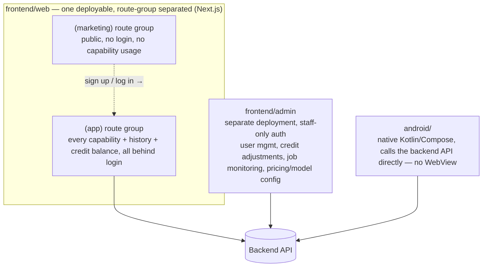

# Product Scope

This document defines *what* the platform does and for *whom*, before `architecture.md` decides *how* it's built. It is expected to change quickly early on — update rows in place rather than freezing the whole document.

## 0. Product priority — this overrides other trade-offs

**The core competitive bet of this rewrite is consumer-facing (C端) experience and latency, not cost or infrastructure simplicity.** When a decision trades off end-user-perceived speed/reliability against something else (hosting cost, single-vendor convenience, engineering time), the user experience side wins by default — it should be argued *against*, not the other way around. Concretely, this already ruled out hosting the backend on Cloudflare Workers ([ADR 0006](decisions/0006-database-orm-choice.md)): tried in practice, latency wasn't good enough, rejected despite the appeal of a single-vendor stack with Cloudflare D1. Apply the same bar to future infra/hosting/CDN choices.

**Why this is the moat, specifically:** every provider behind this platform (Azure, Google, Fish Audio, Kie) is a B2B/developer-facing API, not a consumer product — raw, unfriendly, not designed for an end consumer to use directly. The product's entire value-add is packaging these into a polished, easy, fast consumer experience. Ease-of-use isn't a nice-to-have on top of the "real" product (the AI capabilities) — it *is* the product, since the underlying models are commodity access to the same handful of vendors any competitor can also call.

**Target market: Thai, Indonesian, and Spanish speakers** — not primarily English/Chinese. This is a deliberate departure from the prior project's i18n (en/zh-CN/zh-TW); that locale *content* doesn't carry over (only its switching-infrastructure pattern might, if it's still fit for purpose). It also means there is no single infrastructure region close to every target market — Thai/Indonesian cluster in Southeast Asia, Spanish spans Latin America/Spain/US-Hispanic (which one is still open). Current call: **default to Asia-Pacific** (serves the Thai+Indonesian majority) for Neon and R2, accept worse latency for Spanish-speaking users for now rather than take on multi-region complexity with no traffic yet to justify it. Revisit once there's real usage data, or once a primary/first-launch market among the three is picked.

## 1. Capability matrix

| Capability | Modality | Provider(s) | Provider's native call shape | Auth required | Billing unit | Status |
|---|---|---|---|---|---|---|
| Text-to-speech | Voice | Azure, Google, Fish Audio | Sync (seconds) | Login required | Credits, `f(char_count)` | Decided (capability), interface TBD |
| Voice cloning | Voice | Azure, Google, Fish Audio | Two-stage: async model training (its own job), then the trained voice is used via ordinary sync TTS calls — see §1.1 | Login required | Credits: training priced separately from TTS-with-cloned-voice, formula TBD | Decided — reusable asset ([ADR 0009](decisions/0009-voice-cloning-reusable-asset.md)) |
| Image generation | Image | Kie | Async (submit + poll) | Login required | Credits, formula TBD | Call shape decided, model_id TBD |
| Music generation | Audio | Kie | Async (submit + poll) | Login required | Credits, formula TBD | Call shape decided, model_id TBD |
| Video generation | Video | Kie | Async (submit + poll) | Login required | Credits, `f(duration, resolution)` | Call shape decided, model_id TBD |
| *(others via Kie?)* | ? | Kie | Async (submit + poll), by default | Login required | Credits, formula is config per model_id | By design — new Kie models are config, not new rows here |

**"Provider's native call shape"** is an implementation note, not the API contract: per [ADR 0002](decisions/0002-unified-async-job-model.md), every capability is exposed to the frontend the same way — submit a job, poll it to completion — regardless of whether the underlying provider is natively sync or async.

### 1.1 Decided

- **Kie scope — generic model-catalog gateway.** Kie is a "wholesale" catalog that will keep growing, so it is not modeled as a fixed enum of capabilities. `providers/kie.py` is a generic executor (`run(model_id, inputs) -> JobResult`); which `model_id`s exist and what inputs each expects is **configuration/data**, not code. Adding a new Kie model is a config change, not a deploy of new adapter code.
- **No runtime LLM agent for model selection.** Routing a request to a specific `model_id` is plain config-driven dispatch (the existing `registry.py` pattern), not an AI agent deciding which model to call. An agent-driven "describe what you want, the system picks the model" layer is a possible *future* feature (see §4, Out of scope) but is not part of this design.
- **Design constraint (applies to all providers, stated explicitly because Kie makes it easy to violate):** provider-specific concepts — Kie's `model_id` catalog included — must stay inside the provider's own adapter/config, never leak into `base.py`'s abstract interface or into `services/`. This is what makes dropping a provider later (including Kie itself, if ever) a deletion of one adapter + its config, not a refactor of business logic.
- **Kie webhook support — confirmed.** Kie's task-detail API ([docs](https://docs.kie.ai/market/common/get-task-detail)) supports a `callBackUrl` on task creation as well as polling (`GET /api/v1/jobs/recordInfo`). Decision: use the webhook as the primary path, polling as fallback/verification. Full state-enum mapping and other verified Kie specifics are in [architecture.md §3d](architecture.md).
- **Auth boundary — every capability requires login.** No anonymous/free-tier usage of any capability. Simplifies the credits model too: there is no "unauthenticated usage" path to separately rate-limit or account for.
- **Fish Audio verified** ([API docs](https://docs.fish.audio/api-reference/introduction)): `POST /v1/tts` is synchronous (streams audio directly, same shape as Azure/Google). Voice cloning is **two-stage**: `POST /model` trains a reusable voice model (async — `state`: `created`/`training`/`trained`/`failed`), and the resulting `model_id` is then used via `reference_id` in ordinary sync `/v1/tts` calls to actually generate speech in that voice, as many times as wanted.
- **Voice cloning is a reusable, user-owned asset — confirmed.** Train once, speak many times, for every provider that supports it (not just Fish Audio) — the cloned voice is the user's property, not a one-shot byproduct. See [ADR 0009](decisions/0009-voice-cloning-reusable-asset.md) and the `voice_models` table in [data-model.md](data-model.md). Training consumes credits separately from using the resulting voice (which is priced as ordinary TTS).
- **Public gallery — confirmed as a visibility flag.** Browsing a user's public creations requires no login; only creating/submitting a job (and choosing to make it public) does. It's not a separate content system — see [ADR 0010](decisions/0010-public-gallery-visibility-flag.md) and §3 below.

### 1.2 Open questions still blocking this table

Nothing left blocking the table itself. Remaining open items — pricing numbers, asset persistence numbers, gallery retention/moderation specifics — tracked in §2, §3, and [architecture.md §5](architecture.md).

## 2. Credits / billing

**Decided** — see [ADR 0003](decisions/0003-credit-ledger-hold-then-settle.md) for the full lifecycle:

- Users top up an account balance in **credits** (积分). There is no other billing model in scope (no separate flat per-call pricing, no subscription tiers, for now).
- **Ads are a second, independent monetization channel** (confirmed — native ads on Android, see §3). This doesn't interact with the credit ledger itself — no ADR needed yet; revisit if ad revenue ever needs to grant credits (e.g. "watch an ad for free credits") rather than just running alongside them.
- Cost per call is **not flat** — it's computed from the request's specific parameters, e.g. text length for TTS, duration + resolution for a Kie video model. Different capabilities/models are billed on different parameters, so pricing rules are config/data (same pattern as the Kie model catalog, §1.1), not hardcoded per capability.
- Credits are **held at submission** (based on estimated cost from the requested parameters) and **settled or released when the job reaches a terminal state**: success debits the (possibly recomputed) actual cost and releases any remaining hold; failure releases the hold in full — no charge, matching Kie's own behavior of never billing failed generations (including content/keyword rejections).

Open items (don't block building the ledger, but need answers before it's complete):
- Exact pricing formulas/numbers per capability and per Kie `model_id` — filled in as config as each capability is implemented. For simple per-character/per-call rates (not Kie's structural catalog), these live in `app_settings` ([ADR 0012](decisions/0012-app-settings-table.md)) and are tunable without a deploy — seeded with placeholder values (e.g. `tts_credits_per_10_chars = 1`) rather than blocking on a "final" number.
- Top-up mechanism (payment provider) — not yet chosen; will need its own ADR once decided. Until then, new users get a seeded signup bonus (`app_settings.signup_bonus_credits`, placeholder 500) instead of real purchased credits.

Resolved since first written: Kie reports its own cost per task (`creditsConsumed`), so `actual_cost` settlement for Kie is derived from that rather than guessed — see [ADR 0003](decisions/0003-credit-ledger-hold-then-settle.md) and [architecture.md §3d](architecture.md).

## 3. Frontend surfaces

**Decided** — see [ADR 0005](decisions/0005-frontend-surfaces.md) for the full reasoning. Four surfaces, all plain consumers of the same backend API:

- **Marketing** (`(marketing)` route group): public, no login, no capability usage. Now includes at least one concrete answer to the "what's actually on it" open item: **the public gallery** (jobs marked `visibility: public`, [ADR 0010](decisions/0010-public-gallery-visibility-flag.md)) — a browsable feed of real user creations needs no login, fits naturally here, and doubles as a conversion surface (see other creations → sign up to make your own). Doesn't fully close the "what's on the marketing site" open item, but is a concrete piece of it.
- **Product app** (`(app)` route group, same deployable as marketing but strictly separated in code): every capability in the matrix above, plus history and credit balance/usage — all gated by login (§1.1). History entries stay viewable within the asset retention window ([ADR 0004](decisions/0004-asset-mirroring-r2-retention.md)), not just the ~24h the provider itself keeps the file.
- **Admin**: internal tool, separate app/deployment, staff-only auth. Exact feature scope not decided yet (deferred — see ADR 0005's open items) beyond the general shape: user/credit management, job monitoring, provider and pricing config.
- **Android**: fully native, not a wrapped website — calls the backend API the same way the web app does. Chosen over wrapping (e.g. Capacitor) because of Android-specific friction: saving generated files to the gallery, native ad integration (ads are a planned monetization channel alongside credits — see §2), and runtime permission handling.

## 4. Out of scope (for now)

- Agent/AGI layer (per `CLAUDE.md`, deferred until backend + frontend skeleton runs end-to-end) — including an LLM-driven "describe what you want, the system picks the Kie model" router (see §1.1).
- Payment/top-up provider integration (see §2's open items).
- Admin's exact feature list — deferred by request, general shape only (see §3, ADR 0005).
- Gallery moderation, and whether a public job's asset gets extended retention beyond the normal window — deferred by request, general shape only (see [ADR 0010](decisions/0010-public-gallery-visibility-flag.md)).
- Anything not in the capability matrix above.

## 5. Next steps

Call shape (ADR 0002), credits (ADR 0003), Kie webhook/state handling, the auth boundary, asset persistence (ADR 0004), the frontend surface split (ADR 0005), database/ORM (ADR 0006), the scheduled-task module (ADR 0007), auth provider (ADR 0008), voice cloning as a reusable asset (ADR 0009), and the gallery visibility mechanism (ADR 0010) are all decided. Remaining open items are all config values or deferred scope, not architecture: exact pricing formulas, top-up provider, retention period(s) per capability (§2, ADR 0004), Admin's detailed feature list (§3), and gallery moderation/retention specifics (§4). These get filled in as config/scope when each is picked back up — a new ADR is only needed if one turns out to have structural implications (e.g. a payment webhook needing its own handling).
