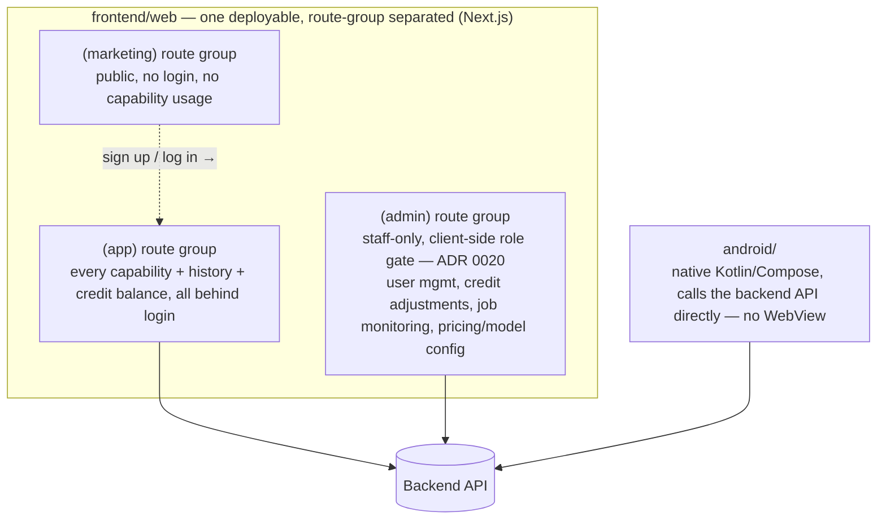

# Product Scope

This document defines *what* the platform does and for *whom*, before `architecture.md` decides *how* it's built. It is expected to change quickly early on — update rows in place rather than freezing the whole document.

## 0. Product priority — this overrides other trade-offs

**The core competitive bet of this rewrite is consumer-facing (C端) experience and latency, not cost or infrastructure simplicity.** When a decision trades off end-user-perceived speed/reliability against something else (hosting cost, single-vendor convenience, engineering time), the user experience side wins by default — it should be argued *against*, not the other way around. Concretely, this already ruled out hosting the backend on Cloudflare Workers ([ADR 0006](decisions/0006-database-orm-choice.md)): tried in practice, latency wasn't good enough, rejected despite the appeal of a single-vendor stack with Cloudflare D1. Apply the same bar to future infra/hosting/CDN choices.

**Why this is the moat, specifically:** every provider behind this platform (Azure, Google, Fish Audio, Kie) is a B2B/developer-facing API, not a consumer product — raw, unfriendly, not designed for an end consumer to use directly. The product's entire value-add is packaging these into a polished, easy, fast consumer experience. Ease-of-use isn't a nice-to-have on top of the "real" product (the AI capabilities) — it *is* the product, since the underlying models are commodity access to the same handful of vendors any competitor can also call.

**Target market: Thai, Indonesian, and Spanish speakers** — not primarily English/Chinese. This is a deliberate departure from the prior project's i18n (en/zh-CN/zh-TW); that locale *content* doesn't carry over (only its switching-infrastructure pattern might, if it's still fit for purpose). It also means there is no single infrastructure region close to every target market — Thai/Indonesian cluster in Southeast Asia, Spanish spans Latin America/Spain/US-Hispanic (which one is still open). Current call: **default to Asia-Pacific** (serves the Thai+Indonesian majority) for Neon and R2, accept worse latency for Spanish-speaking users for now rather than take on multi-region complexity with no traffic yet to justify it. Revisit once there's real usage data, or once a primary/first-launch market among the three is picked.

**Scope of this decision, stated explicitly since it's been misapplied once already**: this is about infra region and *our own UI* language ([ADR 0013](decisions/0013-i18n-routing-strategy.md)) — it says nothing about which languages a *capability* (e.g. TTS voices) may offer. Real traffic (marketing, organic signups) speaks every language, English included; a capability's own catalog (voice list, etc.) should expose everything the underlying provider supports unless there's a provider-specific reason not to, never narrowed to this list.

## 1. Capability matrix

| Capability | Modality | Provider(s) | Provider's native call shape | Auth required | Billing unit | Status |
|---|---|---|---|---|---|---|
| Text-to-speech | Voice | Azure, Google, Fish Audio | Sync (seconds) | Login required | Credits, `f(char_count)` | Decided (capability), interface TBD |
| Voice cloning | Voice | Fish Audio (only — Azure/Google's equivalent is unconfirmed) | Two calls, both sync in practice: `POST /model` trains a reusable voice (its own job — verified synchronous with `train_mode="fast"`, no polling needed), then the trained voice is used via ordinary sync TTS calls — see §1.1 | Login required | Training: free (verified — matches the prior project's own real pricing). Using a cloned voice: ordinary TTS rate, `f(char_count)` | **Implemented and verified** ([ADR 0009](decisions/0009-voice-cloning-reusable-asset.md)) |
| Image generation (text-to-image, image-to-image) | Image | Kie | Async (submit + poll) | Login required | Credits, `f(resolution)`, curated per model | **Implemented and verified** ([ADR 0015](decisions/0015-kie-model-catalog.md)/[0016](decisions/0016-kie-image-to-image-uploads.md)) — both `flux-2/pro-text-to-image` and `flux-2/pro-image-to-image` end-to-end against real infra, including a real uploaded photo genuinely transformed by Kie and its short-lived public copy confirmed deleted afterward |
| Music generation | Audio | Kie | Async (submit + poll) | Login required | Credits, formula TBD | Call shape decided, no models catalogued yet |
| Video generation (image-to-video) | Video | Kie | Async (submit + poll) | Login required | Credits, `f(duration, resolution)` (real per-second rate, ADR 0017) | **Implemented and verified** ([ADR 0017](decisions/0017-kie-video-and-catalog-splitting.md)) — `grok-imagine-video-1-5-preview` end-to-end against real infra, settled cost matched the estimate exactly; Veo 3.1 Lite catalogued but disabled pending one field-value confirmation |
| *(others via Kie?)* | ? | Kie | Async (submit + poll), by default | Login required | Credits, formula is config per model_id | By design — new Kie models are config, not new rows here |

**"Provider's native call shape"** is an implementation note, not the API contract: per [ADR 0002](decisions/0002-unified-async-job-model.md), every capability is exposed to the frontend the same way — submit a job, poll it to completion — regardless of whether the underlying provider is natively sync or async.

### 1.1 Decided

- **Kie scope — generic model-catalog gateway.** Kie is a "wholesale" catalog that will keep growing, so it is not modeled as a fixed enum of capabilities. `providers/kie.py` is a generic executor (`submit(model_id, inputs)`/`poll()`); which `model_id`s exist and what inputs each expects is **configuration/data** (`kie_categories`/`kie_models` tables), not code — **implemented and verified** ([ADR 0015](decisions/0015-kie-model-catalog.md)): confirmed against Kie's real API that no catalog/pricing-discovery endpoint exists at all, so hand-curation isn't a stopgap, it's the only option. Adding a new Kie model is one `POST /admin/kie-models` call, not a deploy of new adapter code.
- **No runtime LLM agent for model selection.** Routing a request to a specific `model_id` is plain config-driven dispatch (the existing `registry.py` pattern), not an AI agent deciding which model to call. An agent-driven "describe what you want, the system picks the model" layer is a possible *future* feature (see §4, Out of scope) but is not part of this design.
- **Design constraint (applies to all providers, stated explicitly because Kie makes it easy to violate):** provider-specific concepts — Kie's `model_id` catalog included — must stay inside the provider's own adapter/config, never leak into `base.py`'s abstract interface or into `services/`. This is what makes dropping a provider later (including Kie itself, if ever) a deletion of one adapter + its config, not a refactor of business logic.
- **Kie webhook support — confirmed.** Kie's task-detail API ([docs](https://docs.kie.ai/market/common/get-task-detail)) supports a `callBackUrl` on task creation as well as polling (`GET /api/v1/jobs/recordInfo`). Decision: use the webhook as the primary path, polling as fallback/verification. Full state-enum mapping and other verified Kie specifics are in [architecture.md §3d](architecture.md).
- **Auth boundary — every capability requires login.** No anonymous/free-tier usage of any capability. Simplifies the credits model too: there is no "unauthenticated usage" path to separately rate-limit or account for.
- **Fish Audio verified** ([API docs](https://docs.fish.audio/api-reference/introduction)): `POST /v1/tts` is synchronous (streams audio directly, same shape as Azure/Google). Voice cloning is **two calls, not two stages** — `POST /model` with `train_mode="fast"` already returns `state: "trained"` synchronously, in the same response (verified against the real API, correcting an earlier assumption that this needed polling); the resulting `model_id` is then used via `reference_id` in ordinary sync `/v1/tts` calls to actually generate speech in that voice, as many times as wanted.
- **Voice cloning is a reusable, user-owned asset — implemented.** Train once, speak many times. Fish Audio only for now (the only provider with a verified cloning integration; whether Azure/Google have an equivalent is still unconfirmed) — the cloned voice is the user's property, not a one-shot byproduct. See [ADR 0009](decisions/0009-voice-cloning-reusable-asset.md) and the `voice_models` table in [data-model.md](data-model.md). **Training is free** — verified against the prior project's own real, already-shipped pricing (it never charged for cloning, only for using a clone to generate speech, at the ordinary per-character TTS rate) — resolving this table's earlier "formula TBD".
- **Public gallery — confirmed as a visibility flag.** Browsing a user's public creations requires no login; only creating/submitting a job (and choosing to make it public) does. It's not a separate content system — see [ADR 0010](decisions/0010-public-gallery-visibility-flag.md) and §3 below.

### 1.2 Open questions still blocking this table

Nothing left blocking the table itself. Remaining open items — pricing numbers, asset persistence numbers, gallery retention/moderation specifics — tracked in §2, §3, and [architecture.md §5](architecture.md).

## 2. Credits / billing

**Decided** — see [ADR 0003](decisions/0003-credit-ledger-hold-then-settle.md) for the full lifecycle:

- Users top up an account balance in **credits** (积分). There is no other billing model in scope (no separate flat per-call pricing, no subscription tiers, for now).
- **Ads are a second, independent monetization channel** (confirmed — native ads on Android, see §3). This doesn't interact with the credit ledger itself — no ADR needed yet; revisit if ad revenue ever needs to grant credits (e.g. "watch an ad for free credits") rather than just running alongside them.
- Cost per call is **not flat** — it's computed from the request's specific parameters, e.g. text length for TTS, duration + resolution for a Kie video model. Different capabilities/models are billed on different parameters, so pricing rules are config/data (same pattern as the Kie model catalog, §1.1), not hardcoded per capability.
- Credits are **held at submission** (based on estimated cost from the requested parameters) and **settled or released when the job reaches a terminal state**: success debits the (possibly recomputed) actual cost and releases any remaining hold; failure releases the hold in full — no charge, matching Kie's own behavior of never billing failed generations (including content/keyword rejections).

Open items (don't block building the ledger, but need answers before it's complete):
- Exact pricing formulas/numbers per capability and per Kie `model_id` — filled in as config as each capability is implemented. For simple per-character/per-call rates (not Kie's structural catalog), these live in `app_settings` ([ADR 0012](decisions/0012-app-settings-table.md)) and are tunable without a deploy — seeded with placeholder values (e.g. `tts_credits_per_10_chars = 1`) rather than blocking on a "final" number.
- Top-up mechanism (payment provider) — not yet chosen; will need its own ADR once decided. Until then, new users get a seeded signup bonus (`app_settings.signup_bonus_credits`, placeholder 500) instead of real purchased credits.

Resolved since first written: Kie reports its own cost per task (`creditsConsumed`), so `actual_cost` settlement for Kie is derived from that directly, 1:1, rather than guessed — verified end to end (a real `flux-2/pro-text-to-image` job settled for exactly the 5 credits Kie reported) — see [ADR 0003](decisions/0003-credit-ledger-hold-then-settle.md), [ADR 0015](decisions/0015-kie-model-catalog.md) and [architecture.md §3d](architecture.md).

## 3. Frontend surfaces

**Decided** — see [ADR 0005](decisions/0005-frontend-surfaces.md)/[ADR 0020](decisions/0020-admin-folded-into-web.md) for the full reasoning. Three surfaces, all plain consumers of the same backend API:

- **Marketing** (`(marketing)` route group): public, no login, no capability usage. **Built** ([ADR 0019](decisions/0019-marketing-site-scope-and-i18n.md)) — seven pages: `/` (home), `/voice`, `/image`, `/video`, `/privacy`, `/terms`, `/contact`. No pricing page yet (no real numbers, §2) and no music page yet (no Kie models catalogued for it). English only — Thai/Indonesian/Spanish are a content-file addition later, not a routing rewrite (ADR 0019's i18n section). The public gallery (jobs marked `visibility: public`, [ADR 0010](decisions/0010-public-gallery-visibility-flag.md)) contributes real, unauthenticated `GET /gallery` data to the homepage (captions/counts, not media playback — asset bytes still require a logged-in viewer).
- **Product app** (`(app)` route group, same deployable as marketing but strictly separated in code): every capability in the matrix above, plus history and credit balance/usage — all gated by login (§1.1). History entries stay viewable within the asset retention window ([ADR 0004](decisions/0004-asset-mirroring-r2-retention.md)), not just the ~24h the provider itself keeps the file.
- **Admin** (`(admin)` route group, same deployable, [ADR 0020](decisions/0020-admin-folded-into-web.md)): not a separate app/deployment as ADR 0005 originally called for — reversed once `frontend/admin` reached admin-screens-actually-needed time still completely empty. Gated client-side by role (`GET /me`'s `role`, a Postgres column, not a Firebase claim), same pattern `(app)`'s own login gate uses; the real enforcement stays server-side (`require_admin` on every `/admin/*` backend route) regardless. Exact feature scope beyond the general shape (user/credit management, job monitoring, provider and pricing config) still not fully decided — deferred.
- **Android**: fully native, not a wrapped website — calls the backend API the same way the web app does. Chosen over wrapping (e.g. Capacitor) because of Android-specific friction: saving generated files to the gallery, native ad integration (ads are a planned monetization channel alongside credits — see §2), and runtime permission handling.

## 4. Out of scope (for now)

- Agent/AGI layer (per `CLAUDE.md`, deferred until backend + frontend skeleton runs end-to-end) — including an LLM-driven "describe what you want, the system picks the Kie model" router (see §1.1).
- Payment/top-up provider integration (see §2's open items).
- Admin's exact feature list — deferred by request, general shape only (see §3, ADR 0005).
- Gallery moderation, and whether a public job's asset gets extended retention beyond the normal window — deferred by request, general shape only (see [ADR 0010](decisions/0010-public-gallery-visibility-flag.md)).
- Anything not in the capability matrix above.

## 5. Next steps

Call shape (ADR 0002), credits (ADR 0003), Kie webhook/state handling, the auth boundary, asset persistence (ADR 0004), the frontend surface split (ADR 0005), database/ORM (ADR 0006), the scheduled-task module (ADR 0007), auth provider (ADR 0008), voice cloning as a reusable asset (ADR 0009), and the gallery visibility mechanism (ADR 0010) are all decided. Remaining open items are all config values or deferred scope, not architecture: exact pricing formulas, top-up provider, retention period(s) per capability (§2, ADR 0004), Admin's detailed feature list (§3), and gallery moderation/retention specifics (§4). These get filled in as config/scope when each is picked back up — a new ADR is only needed if one turns out to have structural implications (e.g. a payment webhook needing its own handling).
